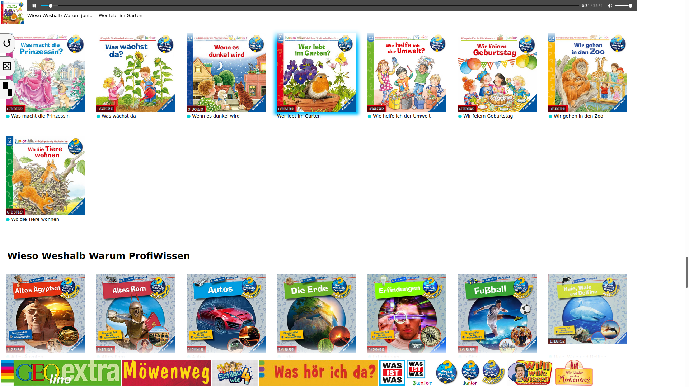

# Jukebox

This is a simple jukebox I made for my daughter. She likes to listen to audiobooks, but when I started writing this, she couldn't read yet and I did not find something appropriate. Well, I didn't even search…

She had an old iPad mini running Mobile Safari 9. I factory-reset it, but since its iOS version was so old, I couldn't install any apps on it. So I decided to go back to the roots and develop a web app (how it was originally intended from Apple but without the `<meta name="apple-mobile-web-app-capable" content="yes">` that made it appear like a real app, because then no audio is played). And here we are. I'm not a frontend engineer which you can tell from both the code and the user interface, but it does the trick.

She had dozens of dozens of audiobooks, from about 6 different series which I call CDs and categories in the following/the code and a couple of audiobooks with only one or two per series. I organized the (MP3) files in a simple `category - title.mp3` naming scheme. For a better overview (especially, since we copied it to an SD card for our car) I organized them additionally in one level of subdirectories for each category. The files that did not belong to a category stayed in the root directory. Further, I took care to embed the cover image into each MP3 file so that the jukebox application could pull it out and display it. I did not consider any other information from the MP3 files' ID3 tags. Read more about my tooling below.

## Installation

It is a stand-alone application without server-side code. Everything is run inside the browser. However, there is a bash file for the server that reads the existing files and creates a JavaScript file that serves as the “database” of the application.

Prepare the files on the server like this:

* `assets/` – This contains auxiliary images such as the apple touch icon.
* `audio/` – This contains all the audio files, for example:
  * `audio/series1/series1 - audiobook1.mp3`
  * `audio/series1/series1 - audiobook2.mp3`
  * `audio/series2/series2 - audiobook1.mp3`
  * `audio/series2/series2 - audiobook2.mp3`
  * `audio/something-not-worth-a-series - audiobook.mp3`

Note that if the directory matches the beginning of the filename, it will be stripped in the HTML output to remove clutter and increase the overview a bit.

* `category pictures/` – This contains pictures for the categories (shown in the footer later). The files inside need to have the same name as the category directories and end with `.jpg`.
* `index.html` – You guessed it, this is the jukebox application.
* `README.md` – This file.
* `update-database.sh` – The bash script that reads the `audio` directory and creates a `database.js` file and a `cover` directory where it copies the cover images of each audio file to be displayed on the page.

Install `ffmpeg` to read out the cover images and `ffprobe` to read out the duration of each audiobook.

Run `update-database.sh` without parameters. It will create everything that is necessary.

## Usage

Just open the page.

There is an autoplay toggle. If this is clicked and blue, it automatically plays the next CD in the list once one is finished. This is intended for the case that a CD might be split into several chapters and all of them are single files and you want to listen to them subsequently). Or if you don't want your child to get wake again to select the next CD.

There is a random button. It plays a random CD.

There is a heatmap button. The jukebox saves the frequency of each CD played in the Local Storage.

You can clear the heatmap information in Local Storage by adding `?clear` to the address.

## Tools

These are some handy commands that I used during production of the audio files. Sometimes I needed to rip them.

* Join MP3 files: `for i in *.mp3; do sox "$i" "$(basename -s .mp3 "$i").wav"; done; sox *.wav output.wav` and convert that to mp3.
* Join WAV files: `sox 1.wav 2.wav 3.wav output.wav` to edit them losslessly with Audacity.
* Read ID3 tags: `id3v2 -l *.mp3`
* Display the cover image dimensions: `identify -format '%w %h %f\n' * | sort -n`
* Create an 800×800 image (Larger images were not displayed in our car.): `convert xxx.jpg -resize 800x800 xxx-800x800.jpg`
* Modify ID3 data: EasyTAG (That's a GUI program.)

