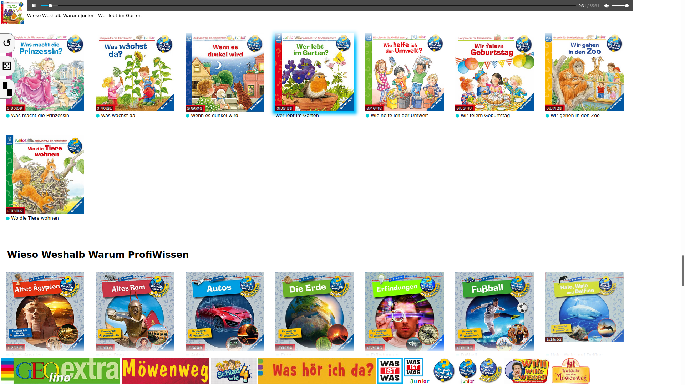

# Jukebox

This is a simple jukebox I made for my daughter. She likes to listen to audiobooks, but when I started writing this, she couldn't read yet and I did not find something appropriate. Well, I didn't even search…

She had gotten an old iPad mini running running iOS 9.3.6 with Mobile Safari 9.0 (WebKit 601.1.46). I factory-reset it, but since its iOS version was so old, I couldn't install any apps on it. So I decided to go back to the roots and develop a web app (how it was originally intended from Apple but without the `<meta name="apple-mobile-web-app-capable" content="yes">` that made it appear like a real app, because then no audio is played). And here we are. I'm not a frontend engineer which you can tell from both the code and the user interface, but it does the trick.




## File naming scheme

She had dozens of dozens of audiobooks, some individual and some from a couple of different series which I call CDs and categories in the following/the code. For a better overview I organized them additionally in one level of subdirectories for each category. (For some categories we had only 1 or 2 CDs, so I did not bother to open up a category for them.) The files that were not assigned to a category stayed in the root directory. Further, I took care to embed the cover image into each MP3 file so that the jukebox application could pull it out and display it. I did not consider any other information from the MP3 files' ID3 tags. (Actually, they probably have no other information set.) Read more about my tooling regarding the MP3 files further down below. For now just assume you have a set of MP3 files with cover images embedded.

So the files are named and organized like this (only for illustration purposes, I did not use English CDs):
```
└── audio
    ├── The Cat Who Wanted to Be a Monkey.mp3
    ├── Magic Tree House - 1 - Dinosaurs Before Dark.mp3
    ├── Magic Tree House - 2 - The Knight at Dawn.mp3
    ├── Magic Tree House - 3 - Mummies in the Morning.mp3
    ├── Harry Potter
    │   ├── Harry Potter.jpg
    │   ├── Harry Potter - 1 - Harry Potter and the Philosopher's Stone.mp3
    │   ├── Harry Potter - 2 - Harry Potter and the Chamber of Secrets.mp3
    │   ├── Harry Potter - 3 - Harry Potter and the Prisoner of Azkaban.mp3
    │   ├── Harry Potter - 4 - Harry Potter and the Goblet of Fire.mp3
    │   ├── Harry Potter - 5 - Harry Potter and the Order of the Phoenix.mp3
    │   ├── Harry Potter - 6 - Harry Potter and the Half-Blood Prince.mp3
    │   └── Harry Potter - 7 - Harry Potter and the Deathly Hallows.mp3
    └── Winnie and Wilbur
        ├── Winnie and Wilbur.jpg
        ├── Winnie and Wilbur - In Space.mp3
        ├── Winnie and Wilbur - The Amazing Pumpkin.mp3
        ├── Winnie and Wilbur - The Dinosaur Day.mp3
        ├── Winnie and Wilbur - The Pirate Adventure.mp3
        ├── Winnie and Wilbur - Under the Sea.mp3
        └── Winnie and Wilbur - Winnie the Witch.mp3
```
Some notes on that:
* Sometimes, I added book numbers to keep them in order, in particular, when the order matters for the story.
* The JPG file is a picture for the whole category. I either found it in the Google's image search or I edited one in GIMP by taking one from a book or CD cover.
* In this illustrative list, some series are not complete.


## Installation

It is a plain JavaScript application without server-side code. Everything is run inside the browser. However, there is a bash file for the server that reads the existing files and creates a JavaScript file that serves as the “database” of the application.

This is how the intended final directory structure looks like:

* `jukebox/` – The root directory of the application.
  * `assets/` – Some javascript and static image files coming from the repository.
  * `audio/` – A tree structure of audio files (see naming scheme section above). In the Docker setup, this directory will be mounted here and should not be actually inside the docker image because it's probably huge.
  * `cache/` – This will be filled with the thumbnails from the files and the database file by the update script. This directory is created by the update script. The location of this directory can be specified via environment variable. In the Docker setup, it's specified to sit just here.
    * `cover/` – A tree structure like `audio/`, but just with JPGs instead of MP3s.
    * `database.js` – All meta information (name, duration, links) that serve as the data foundation for the page.
  * `index.html` – The main HTML file to open.
  * `scripts/` – The directory with the update script (see below).


### Installation without Docker

I switched from a stand-alone application to a dockerized application, so only that is supported. However, of course, it's still possible to run it without Docker. You have to deal with some things by yourself. Most of them you can get from the `Dockerfile`. Those are (probably an incomplete list):
* Programs: For the update script (see below) you need to install the `ffmpeg` package. This will provide the `ffmpeg` program to read out the cover images and `ffprobe` to read out the duration of each audiobook.
* Variables: audio and cache directory
* Update script
* Directory structure: You have to resemble the directory structure from above. Symbolic links are handy for that part.


### Docker

This all can be run in Docker. Here is how to get it running. Let's assume you installed docker already and are in the repo's root directory.

Create the image:
`docker build .`

Run the image (assume that `deadbeef` is the image name):
`docker run --detach --volume "/path/to/audio/on/docker/host":"/jukebox/audio":ro --publish 50080:80 deadbeef`

Start crond to enable automatic updates (both of the container and – if neccessary – the database) (assume that `badc0de` is the container name):
`docker exec badc0de /usr/sbin/crond`

Connect to the container once it's running (assume that `badc0de` is the container name) in case you want to do something in the container:
`docker exec --interactive --tty badc0de /bin/bash`

Stop the container (assume that `badc0de` is the container name):
`docker stop badc0de`


### The update script and how to run it

The update script (`update-database.sh`) is a bash script that reads the `audio` directory (specified via environment variable) and creates a `database.js` file and a `cover` directory inside the `cache` directory (specified via environment variable) where it extracts the cover images of each audio file to be displayed on the page.

If there is an MP3 file where the cover image cannot be extracted (because it's missing, maybe), the script will silently fail. The old (working) database file will stay intact.

All files that are not `*.mp3` are ignored, also `*.MP3`. So you can hide individual files by renaming them.

Directories without cover images (or where the name of the image is not exactly that of the directory) will be used, but the thumbnail of the category is then a missing image.

Call it like this (after having made it executable):
```
export PATH_TO_AUDIO=/path/to/audio
export PATH_TO_CACHE=/path/to/cache
./update-database.sh
```

It will print each analyzed MP3 file.

It's recommended to call it once you add, move, update, or delete any file. But how to find out when it's time to update the database, automatically?

The most sophisticated approach is to use `fswatch` on the audio directory and listen to the events. However, you have to filter out all uninteresting events (updating file attributes by just reading the file (as will happen when playing a file)) and run this as a background job. Further, you don't want to execute the update script while (a possibly larger set of files) are uploaded but only once in the end. So you have to detect streaks. This is what makes this approach complicated.

A simpler approach is to regularly (as a cronjob) check whether something has changed in the audio directory. `mdsum` is a good way to check for file content changes, however, it's quite expensive because there will be many large files and most of the time, there will be no change.

So, I decided to go just by file size instead. When a file is changed (e.g., the cover image got replaced or the file was appended because it wasn't fully uploaded the last time), very likely the file size of the file will change. And checking the file size is very cheap.

Hence, the idea is to iterate over all files (MP3 and JPG for the category image) and for each file print the exact size. This list is then hashed to detect added/moved/deleted files. This resulting hash is then saved in a file and compared to in the next run. If it changed, the hash is updated in the file and the update script is called.


## Usage

Just open the page.

There is an autoplay toggle. If this is clicked and blue, it automatically plays the next CD in the list once one is finished. This is intended for the case that a CD might be split into several chapters and all of them are single files and you want to listen to them subsequently). Or if you don't want your child to get wake again to select the next CD. It seems that this function does not work when the machine is locked. I.e., when you use this jukebox page on a tablet or a phone, make sure that either the screen ever goes off (via the developer tools, for example) or that there is no screen lock code/pattern. In this case, apparently, the autoplay does work (tested on various Android devices).

There is a random button. It plays a random CD.

There is a heatmap button. The jukebox saves the frequency of each CD played in the browser's Local Storage. It's not incredibly useful, but my daughter likes to watch this colored pattern.

You can clear the heatmap information in Local Storage by adding `?clear` to the address.


## Tools

These are some handy tools and commands that I used during production of the audio files. Sometimes I needed to rip them from physical CDs.

* Join MP3 files: `for i in *.mp3; do sox "$i" "$(basename -s .mp3 "$i").wav"; done; sox *.wav output.wav` and convert that to mp3.
* Join WAV files: `sox 1.wav 2.wav 3.wav output.wav` or even `sox *.wav output.wav` to edit them losslessly with Audacity.
* Display the cover image dimensions: `identify -format '%w %h %f\n' * | sort -n`
* Create an 800×800 image (Larger images were not displayed in our car.): `convert xxx.jpg -resize 800x800 xxx-small.jpg`
* ID3 tag handling
  * Read ID3 tags: `id3v2 -l *.mp3`
  * EasyTAG (That's a GUI program.)
  * Clear all tags: `id3v2 --delete-all my-mp3-file.mp3`
  * Set a field: `id3v2 --id3v2-only --TIT2 "a nice title" my-mp3-file.mp3` (other fields are `TPE1`, `TRCK`, `TALB`, and many more)
  * Set a cover image: `eyeD3 --add-image="cover.jpg":FRONT_COVER my-mp3-file.mp3`


## Docker Tips

These are more as a reminder for myself.

To deploy the image to production, you need to build it, upload it to Docker Hub, and instantiate it on the server. This is how:

* Build the image and tag it: `docker build -t tobiaszieger/jukebox .`
* Login to Docker Hub: `docker login`
* Push the image: `docker push tobiaszieger/jukebox`
* Update the image (on the server): `docker pull tobiaszieger/jukebox`
* Stop and remove the container
* Spawn a new container with the (updated) image

